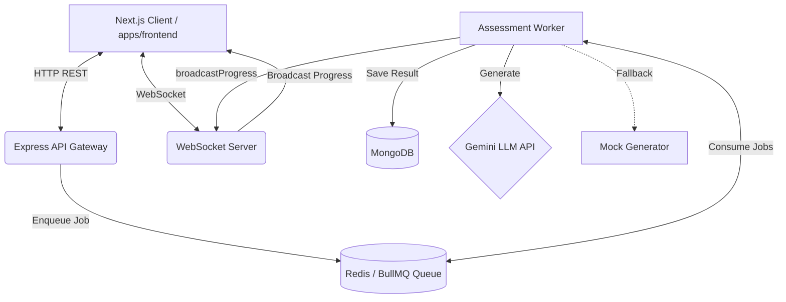
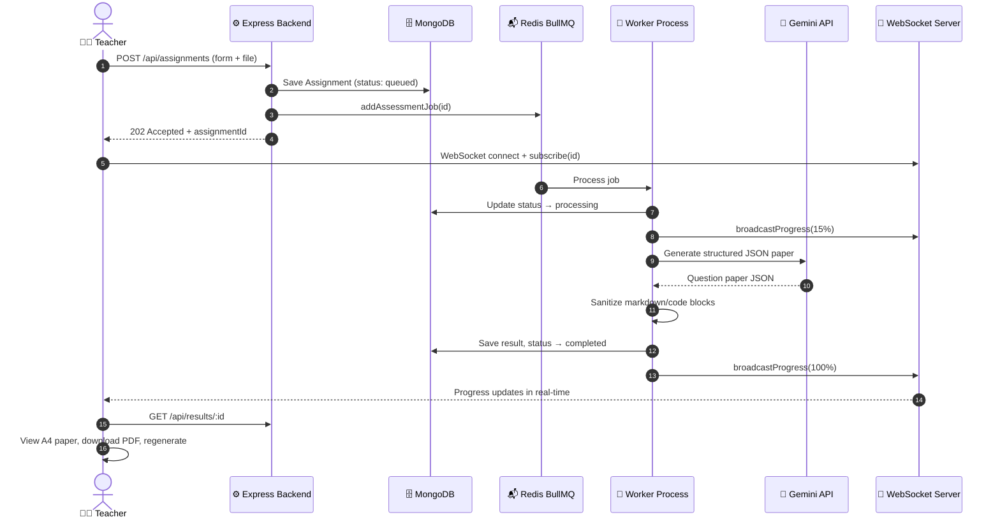

# VedaAI — AI Assessment Creator & Engine

VedaAI is a production-grade, asynchronous AI-powered assessment generation platform built within a TypeScript monorepo. Teachers configure exam parameters, upload curriculum context, track background generation in real-time over WebSockets, and compile print-ready A4 PDF question papers.

---

## 🏗️ System Architecture

### Component Architecture


### End-to-End Request Flow


---

## 💎 Features

### Assignment Creation
- Title, subject, difficulty, question type (MCQ, short/long answer, case-based, mixed)
- Number of questions and marks per question
- Due date picker
- Additional instructions text area
- Context file upload (PDF, DOCX, TXT — up to 10MB, Base64 ingested)
- Full form validation with inline error indicators

### Real-Time Generation Pipeline
- Background BullMQ worker consumes Redis queue jobs
- Progress broadcasts via WebSocket at 15%, 40%, 75%, 100%
- Frontend progress stepper auto-redirects on completion

### AI Paper Generation
- Uses Google Gemini API with structured JSON schema output
- **Automatic fallback**: if `AI_API_KEY` is not set, the built-in academic mock generator produces a realistic structured paper — no crashes, no empty results
- Generated paper includes title, subject, total marks, duration, sections, questions, and answer key

### Paper Review & Export
- A4-style preview on desktop (expanded container)
- Student credential fill-in (name, roll, class) that updates paper in real-time
- PDF download via `jsPDF`
- Regenerate button re-queues the job

### Notification System
- Dynamic unread badge counts on sidebar and mobile footer (Groups, Library)
- Interactive bell dropdown with per-item read tracking
- "Mark all read" action
- Counts clear when sections are visited

### Institutional Branding
- Upload custom school logo via Settings
- Stored as Base64 in MongoDB Profile collection
- Rendered globally in header, sidebar, mobile nav, and paper previews

---

## 🛠️ Tech Stack

| Layer | Technology |
|---|---|
| Frontend | Next.js 16 (App Router, Turbopack), TypeScript, Tailwind CSS, Zustand |
| UI Components | Lucide Icons, jsPDF |
| Backend | Node.js, Express, TypeScript |
| Database | MongoDB (Mongoose ODM) |
| Queue | Redis + BullMQ |
| Real-time | WebSocket (`ws` library) |
| AI | Google Gemini API (with mock fallback) |
| Monorepo | npm workspaces |

---

## 📁 Project Structure

```
vedaai-assessment-creator/
├── apps/
│   ├── backend/                  # Express API + WebSocket + BullMQ worker
│   │   ├── src/
│   │   │   ├── config/db.ts      # MongoDB + Redis connections
│   │   │   ├── controllers/      # assignmentController, profileController, groupController
│   │   │   ├── models/           # Assignment, Profile, Group, GenerationResult
│   │   │   ├── queues/           # BullMQ assessmentQueue
│   │   │   ├── routes/           # assignmentRoutes (all API endpoints)
│   │   │   ├── sockets/          # WebSocket server + broadcastProgress
│   │   │   ├── workers/          # assessmentWorker (AI + mock generator), runWorker
│   │   │   └── index.ts          # Express server entry point
│   │   ├── .env.example
│   │   └── package.json
│   └── frontend/                 # Next.js client
│       ├── app/
│       │   ├── page.tsx          # Dashboard (assignments, groups, library, settings)
│       │   ├── generate/[id]/    # Real-time generation progress page
│       │   └── paper/[id]/       # A4 paper review + PDF export
│       ├── components/
│       │   ├── layout/MobileAppLayout.tsx   # Responsive shell (desktop + mobile)
│       │   ├── Sidebar.tsx        # Desktop navigation sidebar
│       │   └── Toast.tsx          # Notification toasts
│       ├── store/useAssignmentStore.ts      # Zustand global store
│       ├── .env.example
│       └── package.json
├── packages/
│   └── shared/                   # Shared TypeScript interfaces (IAssignment, IQuestionPaper, etc.)
├── docker-compose.yml            # Local MongoDB + Redis containers
├── .gitignore
├── package.json                  # Monorepo workspace root
└── README.md
```

---

## 🗄️ Database Collections

### `assignments`
Stores all form parameters, BullMQ job state, and the embedded generated question paper.

Key fields: `title`, `subject`, `difficulty`, `questionType`, `numQuestions`, `marksPerQuestion`, `dueDate`, `additionalInstructions`, `fileContent`, `status` (`queued|processing|generating|completed|failed`), `progress`, `result` (nested `QuestionPaper`), `groupId`, `jobId`.

### `profiles`
Single institutional profile document — school name, branch, teacher name/email, board affiliation, AI engine setting, default exam preferences, and Base64 school logo.

### `groups`
Class/cohort records — name, subject, grade, student count, assignment count, colour theme.

### `generationresults`
Indexed mapping of `assignmentId` → cached question paper result + status.

---

## 🚀 Quick Start

### Prerequisites
- Node.js v18+ / v20+
- MongoDB running on port `27017`
- Redis running on port `6379`

> **Docker shortcut** — start MongoDB and Redis instantly:
> ```bash
> docker-compose up -d
> ```

### 1. Install all dependencies
```bash
npm install --legacy-peer-deps
```

### 2. Configure environment

**Backend** — copy and fill:
```bash
cp apps/backend/.env.example apps/backend/.env
```

**Frontend** — copy and fill:
```bash
cp apps/frontend/.env.example apps/frontend/.env.local
```

> ⚠️ **Never commit `.env` or `.env.local`** — they are blocked by `.gitignore`.

### 3. Start all processes

Open three terminal tabs:

```bash
# Tab 1 — Backend API + WebSocket server
npm run dev:backend

# Tab 2 — Background AI generation worker
npm run start:worker

# Tab 3 — Next.js frontend
npm run dev:frontend
```

Open [http://localhost:3000](http://localhost:3000).

---

## 🔌 API Reference

| Method | Endpoint | Description |
|---|---|---|
| `GET` | `/api/health` | Health check — returns MongoDB + Redis status |
| `GET` | `/api/assignments` | List all assignments |
| `POST` | `/api/assignments` | Create assignment + enqueue generation job |
| `GET` | `/api/assignments/:id` | Get assignment by ID |
| `DELETE` | `/api/assignments/:id` | Delete assignment |
| `GET` | `/api/results/:assignmentId` | Get generated question paper |
| `POST` | `/api/assignments/:id/regenerate` | Re-queue generation for existing assignment |
| `GET` | `/api/profile` | Get institution profile |
| `PUT` | `/api/profile` | Update institution profile |
| `GET` | `/api/groups` | List class groups |

---

## 🤖 AI Generation & Mock Fallback

VedaAI uses the Google Gemini API for question paper generation.

**To use real AI generation:**  
Set `AI_API_KEY=your_gemini_api_key_here` in `apps/backend/.env`.

**Mock fallback (default when key is absent):**  
The system automatically falls back to a deterministic mock academic generator that produces a complete, realistic question paper with proper sections, question types, difficulty levels, and an answer key. No manual configuration required — it just works.

---

## 🏗️ Production Build

```bash
# Verify both builds compile cleanly
npm run build:backend
npm run build:frontend
```

---

## 🔒 Security Notes

- Real API keys are **never** committed to git — `.gitignore` blocks all `.env` file variants
- Only `.env.example` files (with placeholder values) are tracked
- Before pushing to GitHub, verify:
  ```bash
  git ls-files | grep -E "(\.env|\.env\.local)"   # should return nothing
  git grep -n "AIza"                               # should return nothing
  ```
- CORS is configured via `FRONTEND_URL` environment variable

---

## 🐳 Docker Compose

```yaml
# docker-compose.yml — starts MongoDB and Redis locally
services:
  mongodb:
    image: mongo:7
    ports: ["27017:27017"]
  redis:
    image: redis:7-alpine
    ports: ["6379:6379"]
```

```bash
docker-compose up -d    # Start containers
docker-compose down     # Stop containers
```
